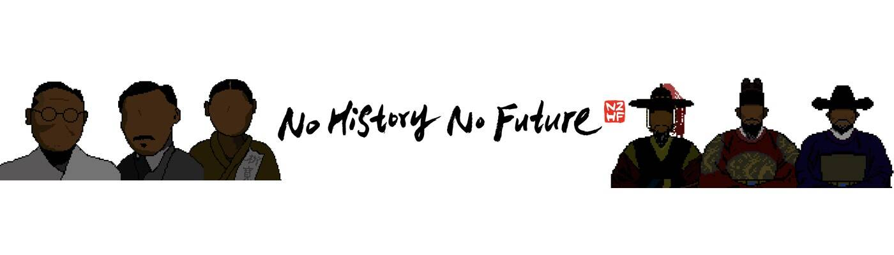

# No History No Future

“没有历史就没有未来”
“一个忘记历史的国家没有未来。” No History No Future (N2HF) 是一个包含历史的 Klaytn NFT 项目，旨在告知和记住正确的历史。本项目中的所有 NFT 均由独特的图像组成，任何人都可以通过参与来收集与历史上重大事件相关的人或文物的 NFT。收集到的 NFT 将用于 Staking 和 Metaverse 的历史记录，以便稍后提供服务。我们希望您可以通过这个项目重温我们伟大祖先的足迹。主页：http://n2hf.com Kakao 公开聊天：https://open.kakao.com/o/gCKUioDd

