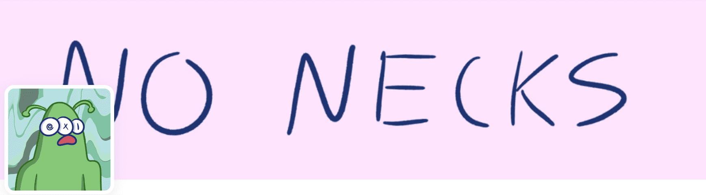

# No Necks NFT

5555 个 NoNeck 字符的种类。没有脖子，所有的共鸣。No Necks NFT NFT 在过去 7 天内售出 144 次。No Necks NFT 的总销售额为 1.05 万美元。一个 No Necks NFT NFT 的平均价格为 7.3 美元。有 3,601 名 No Necks NFT 所有者，总共拥有 5,555 个代币。▶ 什么是无脖子 NFT？

No Necks NFT 是一个 NFT（不可替代代币）集合。存储在区块链上的数字艺术品集合。

##### ▶ No Necks NFT 代币有多少？

总共有 5,555 个 No Necks NFT NFT。目前，3,601 位所有者的钱包中至少有一个 No Necks NFT NTF。

##### ▶ 最昂贵的 No Necks NFT 销售是什么？

出售的最昂贵的 No Necks NFT NFT 是 [NoNecks #3225](https://www.nft-stats.com/asset/0x30575dc53503d4f31edf515f34ada9d8f135c377/3225)。它于 2022-06-30（大约 2 个月前）以 54.9 美元的价格售出。

##### ▶ 最近卖出了多少 No Necks NFT？

过去 30 天内售出了 144 个 No Necks NFT NFT。

