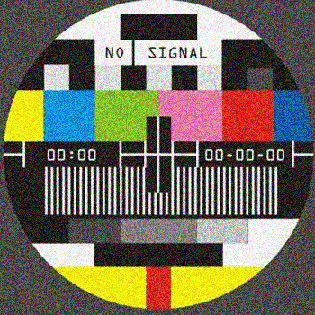

# No Signal ETH

这是我有生以来在彩电上看到的第一幅图像。无信号头 NFT - 常见问题 (FAQ)

##### ▶ 什么是无信号头？

No Signal Heads 是一个 NFT（不可替代代币）集合。存储在区块链上的数字艺术品集合。

##### ▶ 有多少个无信号头代币？

总共有 28 个无信号头 NFT。目前 5 位所有者的钱包中至少有一个 No Signal Heads NTF。

##### ▶ 最近卖出了多少个无信号头？

过去 30 天内售出 0 个 No Signal Heads NFT。过去 7 天没有售出无信号头。

