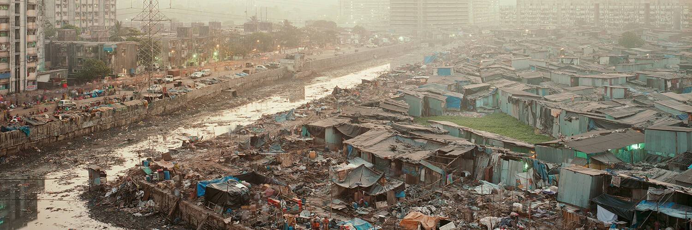

# Noah Addis Archive - Cuba

我作为摄影师的故事很长。我的初恋是街头摄影和新闻摄影。从 2001 年到 2003 年，我去了几次古巴，只带了一台徕卡相机、一个 35 毫米镜头和许多 Tri-X 胶卷。该收藏是该作品的档案。随着年龄的增长，我一直在思考我的遗产和历史，我正在创作这部作品，因为它对我作为艺术家的发展很重要，因为我希望它永远保存在区块链上。艺术家。后纪实摄影师。由 Whalesharketh、Pixelpete 和 Johnathan FireEater 收集。 http://noahaddis.xyz

