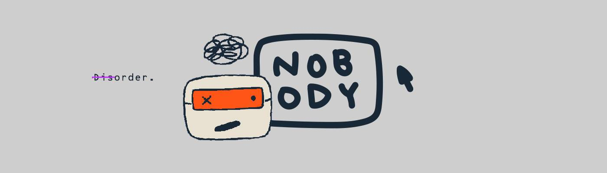

# Nobodyeth.art

没有人 。NFT 在过去 7 天内售出 9 次。没有人的总销量。是 178.68 美元。一个人的平均价格。NFT 是 19.9 美元。有 1,227 没有人。所有者，拥有总供应量 3,210 个代币。

可点击/交互式 NFT - 3210 个无人 NFT 的集合

每个 NFT 都有 2 组可发现的动画。有时我们可以以较低的恒定量释放能量，或者有时认为我们很好，然后积极和/或消极地爆发。我们只需要不时刷新自己。

没有人 。NFT - 常见问题（FAQ）

##### ▶ 什么是无名小卒。？

没有人 。是一个 NFT（不可替代代币）集合。存储在区块链上的数字艺术品集合。

##### ▶ 多少人。代币存在吗？

总共有 3,210 人。NFT。目前 1,227 位所有者至少有一个 无名 。NTF 在他们的钱包里。

##### ▶ 什么人最贵。销售？

最贵的Nobody。出售的 NFT [无人问津#1303-0229670](https://www.nft-stats.com/asset/0x219463d0675c3fa01c1edf537ec5dc693b6410ae/1303)。它于 2022-07-29（25 天前）以 33.8 美元的价格售出。

##### ▶ 多少人。最近有卖吗？

有 34 人。过去 30 天内售出的 NFT。

##### ▶ 一个人多少钱。成本？

在过去 30 天里，最便宜的没人。NFT 销售额低于 13 美元，最高销售额超过 31 美元。无人值守的中位数价格。NFT 在过去 30 天内为 20 美元。

##### ▶什么是受欢迎的Nobody。备择方案？

许多拥有“Nobody”的用户。NFT 还拥有 [Nowhere 。](https://www.nft-stats.com/collection/nobodynowhere), [Che-Yu Wu x 没人](https://www.nft-stats.com/collection/cheyuwuxnobody), [STACY](https://www.nft-stats.com/collection/stacypills)和 [Borpacasso](https://www.nft-stats.com/collection/borpacasso)。

