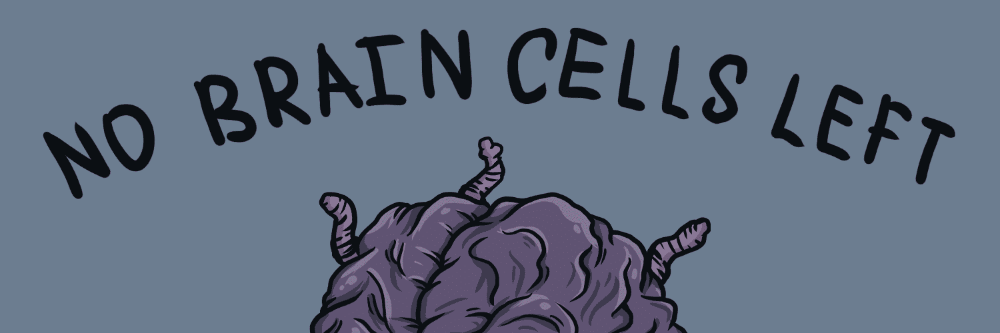

# nobraincells

如果你拿着这个，你就没有脑细胞

### nobraincells NFT - 常见问题（FAQ）

##### ▶ 什么是无脑细胞？

nobraincells 是一个 NFT（不可替代令牌）集合。存储在区块链上的数字艺术品集合。

##### ▶ 存在多少个 nobraincells 代币？

总共有 5,000 个 nobraincells NFT。目前，2,919 位车主的钱包中至少有一个 nobraincells NTF。

##### ▶ 最近卖出了多少个 nobraincells？

过去 30 天内售出了 264 个 nobraincells NFT。

##### ▶ 一个 nobraincells 的成本是多少？

在过去 30 天里，最便宜的 nobraincells NFT 销售额低于 3 美元，最高销售额超过 38 美元。在过去 30 天内，nobraincells NFT 的中位价格为 18 美元。

##### ▶ 什么是流行的 nobraincells 替代品？

许多拥有 nobraincells NFT 的用户还拥有 [Quakheads](https://www.nft-stats.com/collection/quakheads)、 [Final Dungeon](https://www.nft-stats.com/collection/final-dungeon)、 [Okay Moonbirds](https://www.nft-stats.com/collection/okay-moonbirds)和 [goblinbucks](https://www.nft-stats.com/collection/goblinbucks)。

