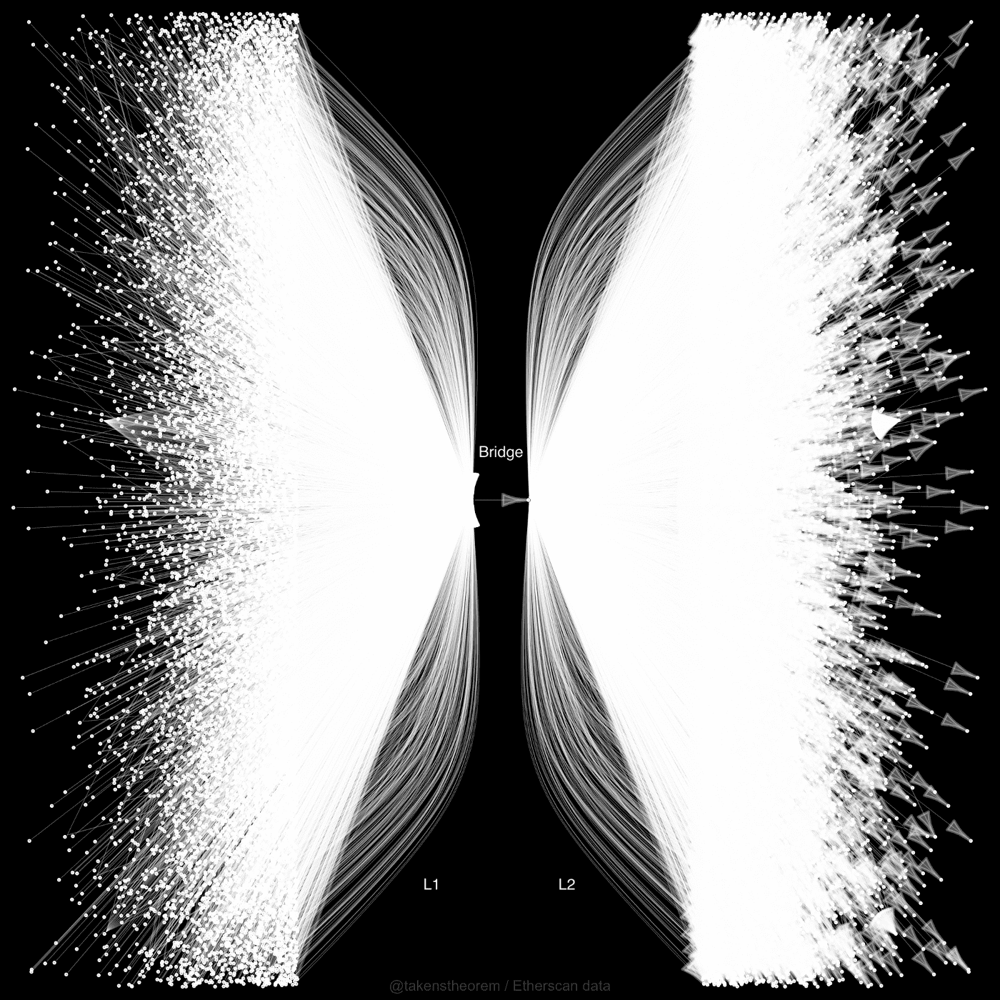

# NodeDoges_

由lazyminter.eth 带给您//可爱的NodeDoges_。分布在 7 个区块链 LayerZero。每个 .005 ETH。节点将狗狗们聚集在一起。NodeDoges 为持有者镜像了 Lightning TripyNode（RPC 节点）。NFT dApp。第 2 层技术发布 WL，适用于 5 个或更多 NodeDoges 的持有者。

第 2 层游乐场
L2 发展迅速，现在很容易尝试。这是可广泛采用的 L2 小产品指南。
内容
介绍
为什么 L1 → L2？
产品尺寸
- 维度 1：什么是 L2？
- 维度 2：验证方法
- 维度 3：市场专业化
- 维度 4：生态系统进步
重要的限制和风险🚧
进一步阅读、尾注、免责声明
⭐️更多：超级快速L2快速入门⭐️
介绍
这篇文章是关于第二层 (L2) 扩展的，重点是以太坊。我是为初到中级的区块链爱好者写的——有在以太坊或其他主链上进行交易的经验，但对 L2 及其进展知之甚少的人。

这篇文章的重点是将 L2 解决方案描述为一种产品。在另一篇文章中，我认为用这些术语思考是有帮助的。产品思维有助于加强审查和消费者谨慎。产品竞争。他们有喜欢或不喜欢的特征。从这些方面思考可以鼓励仔细权衡潜在的成本和收益。当我们搜索几乎任何东西（从新笔到新笔记本电脑）时，都会进行产品评估和比较。我们分类、保存、审查和过滤。为什么不对所有加密产品进行这样的决策呢？

作为一个产品类，第二层（L2）是令人兴奋的。首先，您必须选择要发送您的 L1（以太坊）资产的 L2。这称为“桥接”。随着最近一些 L2 解决方案的发布，数以千计的以太坊参与者已经将资金转移到一些选定的 L2（见下图）。它正在进入一个与主链及其产品平行的世界。当您进行交易时，感觉就像是区块链传送——交易在几乎没有延迟或成本的情况下进行。

