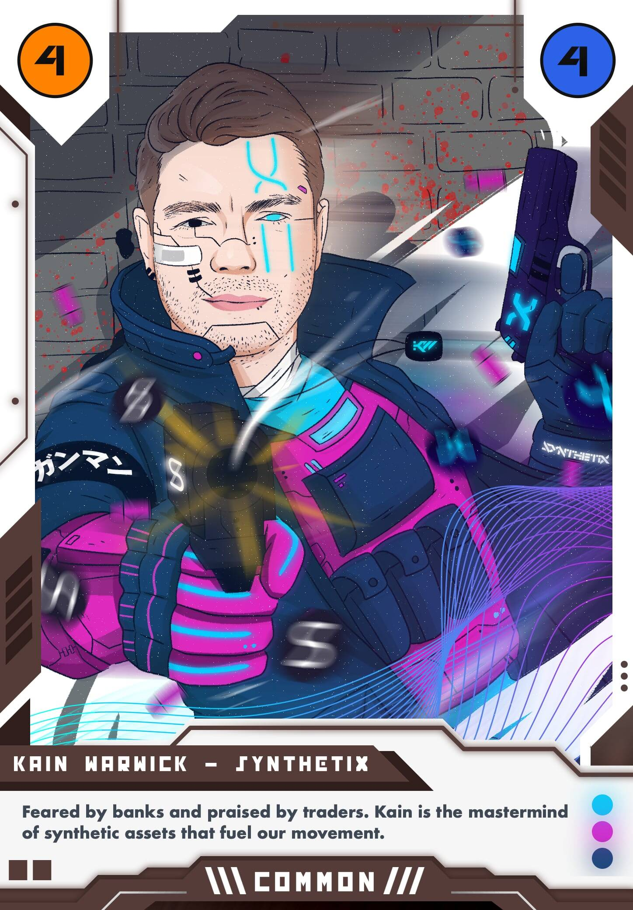

# Node Runners

加入抵抗运动，为去中心化的明天而战。

**凯恩·沃里克**银行害怕，交易员称赞。Kain 是推动我们运动的合成资产的策划者。销售将于 2023 年 2 月 5 日下午 5:57 GMT+8结束 

**Node Runners NFT - 常见问题（FAQ）**

▶ 什么是节点运行器？

Node Runners 是一个 NFT（Non-fungible token）集合。存储在区块链上的数字艺术品集合。

▶ 存在多少个 Node Runners 代币？

总共有 32 个 Node Runners NFT。目前 297 位所有者的钱包中至少有一个 Node Runners NTF。

▶ 最近卖出了多少 Node Runners？

过去 30 天内售出 0 个 Node Runners NFT。

