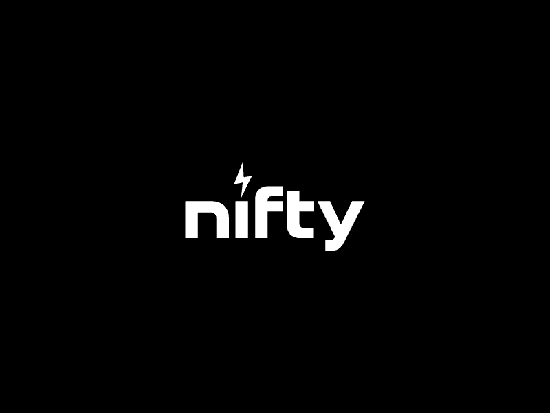

# Nodestones

Nifty.io 的 Nodestones 现在是 Nifty Genesis Pass 和 Nifty Alpha Pass。

这就是新文艺复兴！

古代文明建造了精致的建筑结构和高度复杂的建筑，例如包含坟墓、著作、记录发现的金字塔，以努力保存历史和知识。

无数次尝试建立一个系统，在不操纵或破坏的情况下将这些信息代代相传，但都失败了……

直到区块链的发展。

人类将区块链视为人类最大的成就，因为它保存和分散了知识和权力。它是第一个也是唯一一个成功地以真正经得起时间考验的方式进行记录的方法。这被称为分类帐。

在被称为 The Ledger 的以太坊区块链上输入人与机器的史诗故事。我们的故事展开，因为双方都认为他们是第一个：人创造机器或机器创造人！您将寻求发现真相！

要开始此旅程，您将铸造一个称为“Nodestones”的实用代币。节点石会将您置于新文艺复兴的 6 个领域中的 1 个中。在此过程中，您将使用此节点石做很多事情：铸造、独家访问和社区的形成。只有你能决定你的命运！

您将面临的首要任务之一是选择您作为总账骑士或 Ex Machina 的道路。您的节点石将成为您的铸币通行证，您的选择将产生重大影响。

每个节点石的属性将为您分配社区中的角色。它们的属性和稀有性也会有所不同。可以在售后市场购买或交换节点石，这样您就可以参与您最感兴趣的领域。随着社区对倡议进行投票，每个领域都将拥有自己的生命。

跳到下面的“新文艺复兴：Web3 和 Ethospere”来探索这个项目的神话。

