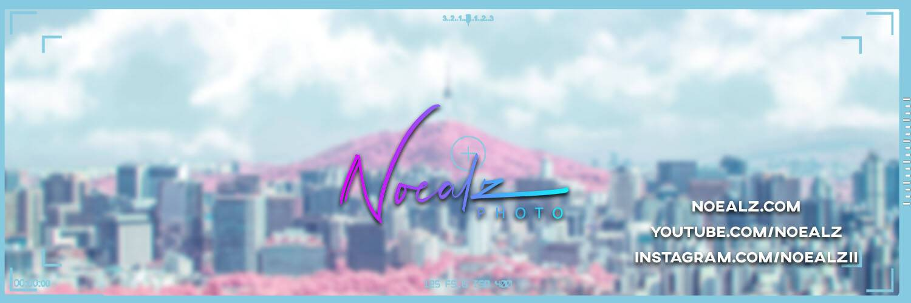

# Noealz

Zero-One 是 Noealz 和 Saucebook 之间的合作项目。它是摄影和人工智能的结合，创造出独特的赛博朋克。零一是来自矩阵的机器城的名称。

Saucebook 使用生成对抗网络 (GAN) 来训练照片的特征以匹配文本提示的属性。Noealz 以他的摄影和生活事物为基础。以两种不同的风格描绘了三个城市。香港、东京和首尔。

该项目旨在为艺术而艺术。它不是一个 9999 生成项目。也不会有任何空投。这简直就是特别的艺术。

