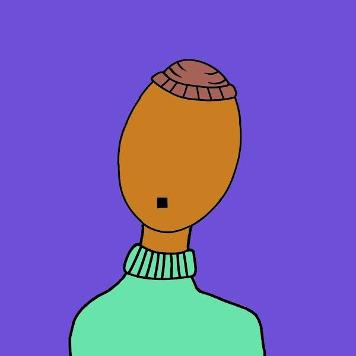

# NOFACES by Ian

NOFACES 是一个灵感来自俄罗斯艺术家 Anna Leporskaya 的三个人物的系列。

这些 1/1 图像旨在创造和培养文化包容性，方法是用一张空白的脸制作可识别的特征，并允许任何人找到他们可以识别的 NOFACE。

**Ian NFT 的 NOFACES - 常见问题（FAQ）**

▶ Ian 的 NOFACES 是什么？

Ian 的 NOFACES 是一个 NFT（不可替代令牌）集合。存储在区块链上的数字艺术品集合。

▶ Ian 代币存在多少 NOFACES？

Ian NFT 总共有 29 个 NOFACES。目前 5 位所有者的钱包中至少有一个 Ian NTF 的 NOFACES。

▶ Ian 最近卖出了多少 NOFACES？

在过去 30 天里，Ian NFT 共售出 0 个 NOFACES。

