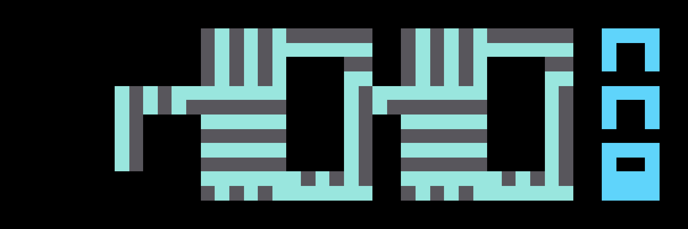

# noggles88im

Dcats_n0uns NFT 在过去 7 天内售出 2 次。Dcats_n0uns 的总销售额为 13.17 美元。一个 Dcats_n0uns NFT 的平均价格为 6.6 美元。共有 9 个 Dcats_n0uns 所有者，总共拥有 20 个代币。

**Dcats_n0uns NFT - 常见问题（FAQ）**

▶ 什么是 Dcats_n0uns？

Dcats_n0uns 是一个 NFT（Non-fungible token）集合。存储在区块链上的数字艺术品集合。

▶ 存在多少个 Dcats_n0uns 代币？

总共有 20 个 Dcats_n0uns NFT。目前 9 位所有者的钱包中至少有一个 Dcats_n0uns NTF。

▶ 最昂贵的 Dcats_n0uns 销售是什么？

出售的最昂贵的 Dcats_n0uns NFT 是 [N0uns x Dcats #18 -text omg](https://www.nft-stats.com/asset/0x2953399124f0cbb46d2cbacd8a89cf0599974963/35866715665305048888288570605306198271318463734037998489131301226407805321217)。它于 2022-07-02（大约 2 个月前）以 6.6 美元的价格售出。

▶ 最近卖出了多少 Dcats_n0un？

过去 30 天内售出了 2 个 Dcats_n0uns NFT。

▶ 什么是流行的 Dcats_n0uns 替代品？

许多拥有 Dcats_n0uns NFT 的用户还拥有 [Noun GIF](https://www.nft-stats.com/collection/noun-gif)、 CHIBI[乌克兰慈善收藏](https://www.nft-stats.com/collection/chibi-ukraine)、 [牛奶兔子](https://www.nft-stats.com/collection/peaceful2alian)和 [01-polaris](https://www.nft-stats.com/collection/01-polaris)。

