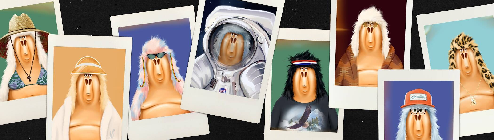

# Nomad Blvd | Collectibles

Nomad NFT 以 Isabelle 著名的 Isabelle Gorilla 角色为基础，她于 2011 年首次绘制该角色。Nomad 代表未经审查的人类——我们在我们投射的图像之下。在由媒体构建的美貌和名人理想所定义的文化中，伊莎贝尔的大猩猩代表着真实性和自我接纳。他们任凭一切流连忘返，尽管他们大而多毛的身体和大肚腩，但他们安静地自信且不为所动。他们是游牧民族，不受社会期望的束缚。随着元宇宙对身份、地位和成功提出新的挑战，游牧民族就像一面镜子。他们就是我们，我们就是他们。他们邀请我们不要把任何事情看得太认真，嘲笑自己，拥抱生活的荒谬。他们在这里提醒我们什么是重要的，我们的 IRL 缺陷，

游牧民族通过燃烧薄荷通行证随机分配：您可以在这里购买通行证：[https ://opensea.io/collection/nomadblvd-mintpass](https://opensea.io/collection/nomadblvd-mintpass)

