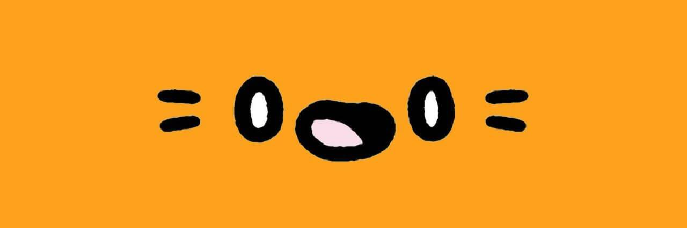

# Non Cool Cats

10,000 只诞生在以太坊区块链上的 NoncoolCats 准备席卷 NFT 土地，我们不隶属于 Cool Cats。 #MEW 没有人可以取消去中心化。Non Cool Cats NFT - 常见问题（FAQ）

##### ▶ 什么是非酷猫？

Non Cool Cats 是一个 NFT（不可替代代币）集合。存储在区块链上的数字艺术品集合。

##### ▶ 有多少非酷猫代币？

总共有 1,036 个 Non Cool Cats NFT。目前，131 位业主的钱包中至少有一个 Non Cool Cats NTF。

##### ▶ 最近卖出了几只非酷猫？

过去 30 天内售出了 0 个 Non Cool Cats NFT。

