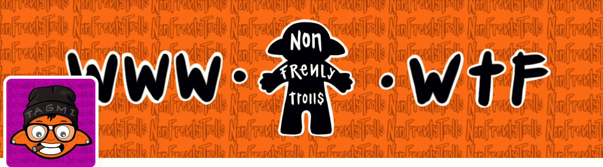

# Non Frenly Trolls

Non Frenly Trolls 是 10,000 个独特的 Troll NFT 的集合。没有不和谐，没有路线图，没有给出他妈的！LetsTrollNon Frenly Trolls NFT 在过去 7 天内售出 19 次。Non Frenly Trolls 的总销售额为 28.43 美元。一个 Non Frenly Trolls NFT 的平均价格为 1.5 美元。有 1,856 名 Non Frenly Trolls 所有者，总共拥有 9,995 个代币。Non Frenly Trolls NFT - 常见问题（FAQ）

##### ▶ 什么是非狂热巨魔？

Non Frenly Trolls 是一个 NFT（不可替代令牌）集合。存储在区块链上的数字艺术品集合。

##### ▶ 有多少个 Non Frenly Trolls 代币？

总共有 9,995 个 Non Frenly Trolls NFT。目前，1,856 名所有者的钱包中至少有一个 Non Frenly Trolls NTF。

##### ▶ Non Frenly Trolls 最昂贵的促销活动是什么？

出售的最昂贵的 Non Frenly Trolls NFT 是 [Non Frenly Trolls #4612](https://www.nft-stats.com/asset/0x03e836cfddcaf8683751925308ae985734955b33/4612)。它于 2022-06-21（2 个月前）以 54.9 美元的价格售出。

##### ▶ 最近卖出了多少非狂热巨魔？

过去 30 天内售出了 455 个 Non Frenly Trolls NFT。

##### ▶ Non Frenly Trolls 的费用是多少？

在过去 30 天内，最便宜的 Non Frenly Trolls NFT 销售额低于 1 美元，最高销售额超过 9 美元。过去 30 天内，Non Frenly Trolls NFT 的中位价格为 3 美元。

##### ▶ 什么是流行的 Non Frenly Trolls 替代品？

许多拥有 Non Frenly Trolls NFT 的用户还拥有 [CryptoCaveClub](https://www.nft-stats.com/collection/cryptocaveclub)、 [Epic Elephants Squad](https://www.nft-stats.com/collection/epic-elephants-squad)、

