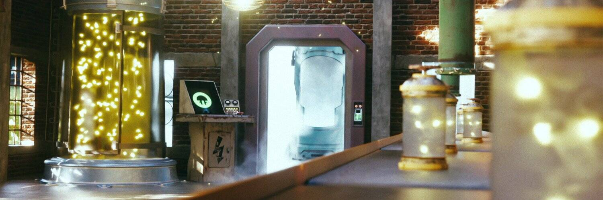

# Non-Fungible Fungi Airdrops

Non-Fungible Fungi 集体是一个由 10,100 个独特的 3D 动画（和魔法）蘑菇 NFT 组成的王国，它们在以太坊区块链中漫步。每个蘑菇都属于 3 种中的 1 种，魔法、沼泽和沼泽标准，其中魔法是最稀有的，而沼泽是最常见的。

100 Genesis Mushroom 为我们提供了祖父特征，从那里我们有许多不同的特征，包括稀有性和外观，构成 10,000 Generative 收藏。

### Fungible Fungi Airdrops NFT - 常见问题（FAQ）

##### ▶ 什么是可替代真菌空投？

Fungible Fungi Airdrops 是一个 NFT（非同质代币）集合。存储在区块链上的数字艺术品集合。

##### ▶ 有多少 Fungible Fungi Airdrops 代币？

总共有 9 个 Fungible Fungi Airdrops NFT。目前，4,915 位所有者的钱包中至少有一个 Fungible Fungi Airdrops NTF。

##### ▶ 最昂贵的 Fungible Fungi Airdrops 销售是什么？

出售的最昂贵的 Fungible Fungi Airdrops NFT 是 [Choco Bog](https://www.nft-stats.com/asset/0x645f73d226a685f7572961926fd8cec70421c044/2)。它于 2022-06-23（2 个月前）以 4.8 美元的价格售出。

##### ▶ 最近卖出了多少 Fungible Fungi Airdrops？

过去 30 天内售出了 3 个 Fungible Fungi Airdrops NFT。

##### ▶ 什么是流行的 Fungible Fungi Airdrops 替代品？

许多拥有 Fungible Fungi Airdrops NFT 的用户还拥有 [Castle Kid's Eggdrop](https://www.nft-stats.com/collection/castle-kids-eggdrop)、 [Non-Fungible Fungi Airdrops](https://www.nft-stats.com/collection/non-fungible-fungi-airdrops)、 [The HedgeCoin Space (THS)](https://www.nft-stats.com/collection/hedgecoin)和 [HPPRS GIFT SHOP](https://www.nft-stats.com/collection/hpprs-gift-shop)。

