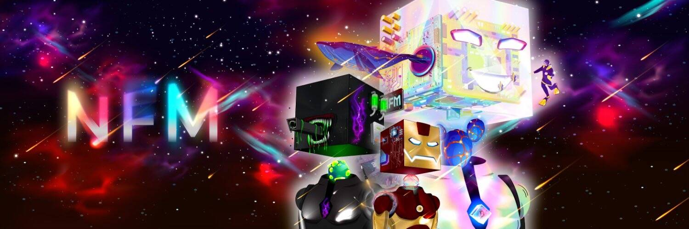

# Non-Fungible Miners Official Collection

采矿和 NFT 爱好者的品牌。为社区而建。

不可替代矿工 (NFM) 是生活在以太坊区块链上的 666 个数字化身的集合，可让您访问多样化的加密采矿生态系统。666 NFM 的原始集合将授予 666 俱乐部的独家会员资格：一群矿工、建设者、艺术家和其他寻求被动收入和基于效用的 NFT 的 web3 爱好者。NFM 持有者将通过 $BTC 挖矿获得 $ETH，并获得独家掉落、体验等。

开采 $BTC。赚取 ETH。与我们一起扩大规模。

那么，谁喜欢钱呢？

**Non-Fungible Miners 官方合集 NFT - 常见问题（FAQ）**

▶ 什么是不可替代矿工官方合集？

Non-Fungible Miners Official Collection 是一个 NFT (Non-fungible token) 集合。存储在区块链上的数字艺术品集合。

▶ 有多少不可替代矿工官方收藏代币？

总共有 666 个不可替代矿工官方收藏 NFT。目前，172 位所有者的钱包中至少有一个 Non-Fungible Miners Official Collection NTF。

▶ 最昂贵的非同质矿工官方收藏品销售是什么？

出售的最昂贵的非同质矿工官方收藏 NFT 是 [NFM #309](https://www.nft-stats.com/asset/0x52735da391fe8a407231c1f9c6f0ef2389378635/309)。它于 2022 年 6 月 8 日（3 个月前）以 455 美元的价格售出。

▶ 最近卖出了多少非同质矿工官方合集？

过去 30 天内售出了 14 个不可替代矿工官方收藏 NFT。

▶ Non-Fungible Miners 官方合集需要多少钱？

过去 30 天，最便宜的 Non-Fungible Miners 官方合集 NFT 销售额低于 250 美元，最高销售额超过 450 美元。过去 30 天内，不可替代矿工官方收藏 NFT 的中位价格为 379 美元。

##### ▶ 有哪些流行的非同质矿工官方收藏替代品？

许多拥有 Non-Fungible Miners Official Collection NFT 的用户还拥有 [RedPanda Gang](https://www.nft-stats.com/collection/redpandagang)、 [Fkn Mutagen](https://www.nft-stats.com/collection/fkn-mutagen)、 [BMC Hashdroid](https://www.nft-stats.com/collection/bmc-hashdroid)和 [CryptoBulldogsOfficial](https://www.nft-stats.com/collection/cryptobulldogsofficial)。

