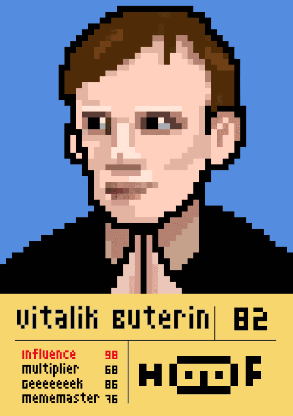

# NonceBox Hall of Fame

NonceBox Crypto **Hall of Fame**是由 NonceBox 创建的像素和类似 Loot 的 NFT 集合。我们将用我们的 HoF 卡建立一个关于财富、权力和名望的加密元世界。每个 NFT 都将是元界游戏中的种子账户或 NPC。

- 这个项目的灵感来自 Crypto Punks 和 Project Loot。我们还从龙与地下城 (DnD/TRPG) 中学到了很多东西。
- 加密历史上的名人是我们卡片的主要部分。我们希望这个项目提供一个发人深省的快照，展示在大规模采用时代初期加密领域最著名的人物。
- 总共有 8000 张 HoF 卡片，由 40 个不同的面孔、4 个基本属性和 1 个总分制成。NonceBox 将收取 3% 的二次特许权使用费来资助社区项目。

