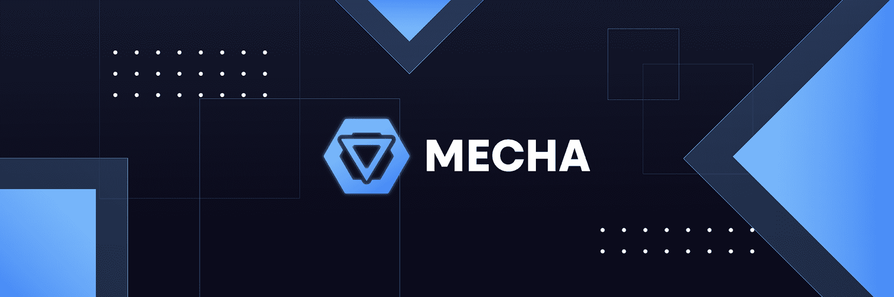

# Mecha Automation

Mecha Automation NFT 在过去 7 天内售出 6 次。Mecha Automation 的总销售额为 410.58 美元。一台 Mecha Automation NFT 的平均价格为 68.4 美元。有 192 名 Mecha Automation 所有者，总共拥有 192 个代币。

在你的钱包中拥有这个代币可以让你访问 Mecha，这是一个轻松铸造 NFT 的软件。

**机甲自动化 NFT - 常见问题（FAQ）**

▶ 什么是机械自动化？

Mecha Automation 是一个 NFT（不可替代令牌）集合。存储在区块链上的数字艺术品集合。

▶ 存在多少 Mecha Automation 代币？

总共有 192 个 Mecha Automation NFT。目前，192 位车主的钱包中至少有一个 Mecha Automation NTF。

▶ 最昂贵的 Mecha Automation 销售是什么？

售出的最昂贵的 Mecha Automation NFT 是 [Mecha #136](https://www.nft-stats.com/asset/0xc6d1ea371b4a020129a01100ce39ea12fcd8d5f6/136)。它于 2022-07-01（大约 2 个月前）以 109.8 美元的价格售出。

▶ 最近卖出了多少台 Mecha Automation？

过去 30 天内售出了 6 个 Mecha Automation NFT。

▶ 什么是流行的机械自动化替代品？

许多拥有 Mecha Automation NFT 的用户还拥有 [Blue Chip Sniper Club](https://www.nft-stats.com/collection/blue-chip-sniper-club)、 [NightmaresByHan](https://www.nft-stats.com/collection/nightmaresbyhan)、 [10EthFloor 官方](https://www.nft-stats.com/collection/10ethfloor-official)和 [HomieFaces NFT 官方](https://www.nft-stats.com/collection/homiefaces-nft-official)。

