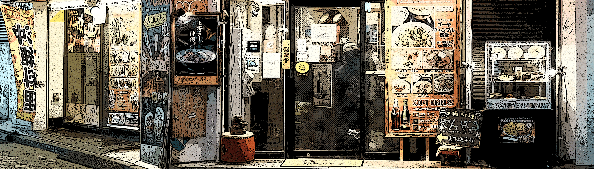

# Nonki Shiba

Nonki Shiba NFT 在过去 7 天内售出 1 次。Nonki Shiba 的总销售额为 32.82 美元。Nonki Shiba NFT 的平均价格为 32.8 美元。有 370 名 Nonki Shiba 所有者，拥有 777 个代币的总供应量。

Nonki Shiba 是一群无忧无虑的 Shiba，他们是伪装大师和所有行业的 inu。他们是唯一可以生成 $NONKI 以获得“Nonkiverse”收藏的稀有门票的 shibas。

**Nonki Shiba NFT - 常见问题（FAQ）**

▶ 什么是Nonki Shiba？

Nonki Shiba 是一个 NFT（非同质代币）集合。存储在区块链上的数字艺术品集合。

▶ 有多少个 Nonki Shiba 代币？

总共有 777 个 Nonki Shiba NFT。目前，370 位车主的钱包中至少有一个 Nonki Shiba NTF。

▶ 什么是最昂贵的 Nonki Shiba 销售？

出售的最昂贵的 Nonki Shiba NFT 是 [Nonki Shiba #638](https://www.nft-stats.com/asset/0xff67ed7f1c7a5cc1b65958d4b3add53dd1a2f86b/638)。它于 2022 年 6 月 9 日（2 个月前）以 53.9 美元的价格售出。

▶ 最近卖了多少个Nonki Shiba？

过去 30 天内售出 4 个 Nonki Shiba NFT。

▶ 什么是流行的 Nonki Shiba 替代品？

许多拥有 Nonki Shiba NFT 的用户还拥有 [Shaq O'Neal Foundation NFT](https://www.nft-stats.com/collection/the-shaq-o-neal-gives-back)、 [Cute&Cat](https://www.nft-stats.com/collection/cute-cat-17)、 [Mutant Bio-Morphans](https://www.nft-stats.com/collection/mutantbiomorphans)和 [Yasagure girl Petite](https://www.nft-stats.com/collection/yasagure-girl-petite)。

