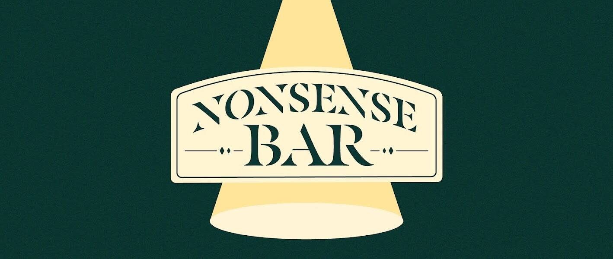

# Nonsense Bar

欢迎来到废话酒吧。美丽的水晶吊灯散布在黑暗的秘密通道上，从宽大的玻璃窗可以欣赏到首尔波光粼粼的夜景......在时尚的私人空间中享受一杯芬芳的单一麦芽威士忌，满足您的五种感官。有点奇怪？我以为是优质威士忌，但标签上的文字是……Johnny Ler，你……？哦...！你是不是已经喝醉了？嗯，没关系。再喝一杯，你会没事的。现在，请举手……干杯！欢迎来到废话酒吧。隔着暗门，美丽的水晶吊灯和宽大的窗外首尔波光粼粼的夜景映入眼帘。在私人休息室享受一杯芬芳的单一麦芽威士忌，满足您的感官。哦？你觉得Nonsens瓶有问题吗？标签上的谷仓名称是... Johnnie, r-, Runner...?...嗯！先生，您已经喝醉了！不过没关系。多喝点就好了。那么一切都会好起来的。举起你的手，然后……干杯！

废话艺术 NFT - 常见问题（FAQ）

▶ 什么是废话艺术？

Nonsense Art  是一个 NFT（Non-fungible token）集合。存储在区块链上的数字艺术品集合。

▶ 有多少个废话艺术  代币？

总共有 43 个 Nonsense Art  NFT。目前，44 位所有者的钱包中至少有一个 Nonsense Art V1 NTF。

▶ 最近卖了多少废话艺术？

过去 30 天内售出了 0 个 Nonsense Art V1 NFT。

