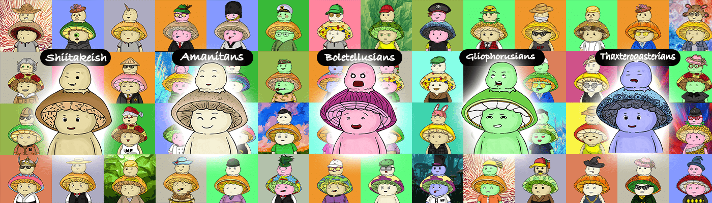

# Nonsense Fungus

Minting Live https://nonsensefungus.com 价格：0.007 ETH 或以上的 15 个 MATICOFFERS 将被接受 -> Nonsense Fungus DeployerNonsense Fungus 是由 DomozLabz 从 500 多个特征通过算法生成的原始数字艺术集合，包含 10,000 个独特组合 在以太坊兼容的多边形网络上存储为 ERC-721 NFT 的所有权证明。了解如何在 Polygon 上购买 NFT .Future Project: - V2: Mutant Nonsense Fungus - V3: Nonsense Fungus Race

废话真菌 NFT - 常见问题（FAQ）

▶ 什么是废话真菌？

Nonsense Fungus 是一个 NFT（Non-fungible token）集合。存储在区块链上的数字艺术品集合。

▶ 有多少个废话真菌代币？

总共有 1,922 个废话真菌 NFT。目前，431 位所有者的钱包中至少有一个 Nonsense Fungus NTF。

▶ 最近卖了多少废柴？

过去 30 天内售出了 0 个 Nonsense Fungus NFT。

