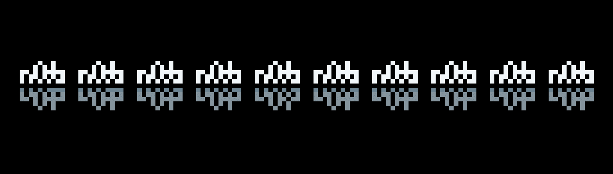

# nOob by GMVerse.studio

nOob 集合是由 Block 先生（Twitter @blockmidas）手绘的首个 NFT 集合。 这是一个兼作实用程序的 PFP。 每个 nOob 都是独一无二的，并且具有将用作未来铸币厂、WL、空投和许多活动的评分机制的固有特征。

GMVerse.studio 的 nOob NFT - 常见问题（FAQ）

▶ GMVerse.studio 的 noOob 是什么？

GMVerse.studio 的 nOob 是一个 NFT（不可替代令牌）集合。存储在区块链上的数字艺术品集合。

▶ GMVerse.studio 代币的 nOob 有多少？

GMVerse.studio NFT 总共有 833 个 nOob。目前，255 位所有者的钱包中至少有一个 GMVerse.studio NTF 的 nOob。

▶ GMVerse.studio 的 noOob 最近卖出了多少？

GMVerse.studio NFT 在过去 30 天内售出 0 个 nOob。

