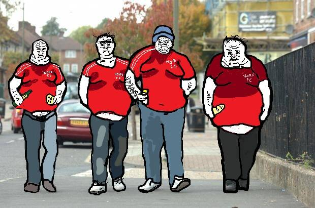

# NORF FC

诺夫 F.C./“简单如”
迷因   Wojak 系列的一部分
查看相关条目

地位：确认的
起源：4chan

年：2018
类型：人物、俚语、陈词滥调、戏仿

1966 年 Norf FC NFT。Luv footy, sossij rolls 'n stella。简单如。不喜欢？你知道门在哪里。
Norf F.C 或“Goalposting”是对源自 4chan 的 /pol/ board 讽刺北英格兰足球迷的一系列图画和插图的昵称。 他们中的人被描绘成英国下层阶级的成员，并且通常是左翼政治和工党的支持者。

它与 Grug、Brainlet 和 Amerimutt 等较早的 Wojak 变体具有相同的特征，并且已经开始扩展到一般的英国北部生活，而不仅仅是足球。

