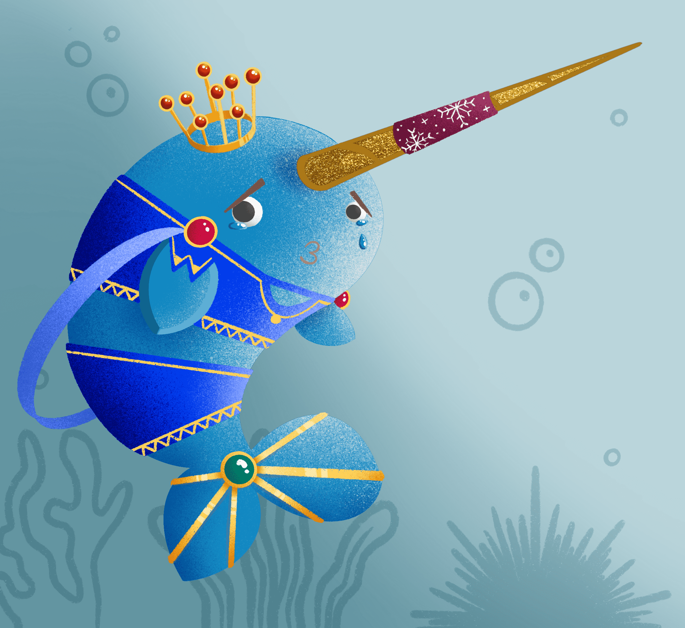

# Norweez - Royals

Norweez 是部署在以太坊网络上的水下虚拟世界，旨在让用户通过无尽的探索、创造和货币化机会沉浸在海洋世界中，同时直接支持海洋恢复计划。

Norweez 是部署在以太坊网络上的水下元宇宙，旨在让用户通过无尽的探索、创造和货币化机会沉浸在海洋世界中，同时直接支持海洋恢复计划。

**成为第一个测试我们的创作者陈列室 Hatcher 的人。**

- 自定义元界 NFT 资产（例如房屋、情节配件）
- 从头开始设计您自己的与海洋相关的 NFT 化身
- 变形其他跨链 NFT 以在 @norweez 内部使用
- 在 Metaverse 中交换 NFT 特征
- 
