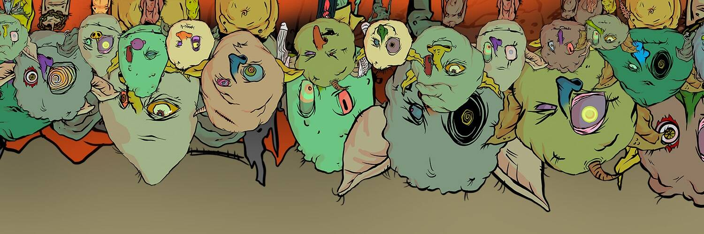

# Not Goblins

不是地精统计

玩 7 岁不是妖精。

这些是deffinitly noooott gobblins goblinnnnnnnnnnnns，我们要去goblintown，你偷偷偷偷摸摸地偷偷摸摸的老鼠是yummmz，这是一个nefteee或gobblings oooo oooooh老鼠。 哦。crustybutt goblinking 说 GEE EMMM DEDJEN RUTS，queenie 说 HLLO SWEATIES

Not Goblins NFT - 常见问题（FAQ）
▶ 什么是非地精？
Not Goblins 是一个 NFT（不可替代代币）集合。存储在区块链上的数字艺术品集合。
▶ 有多少个 Not Goblins 代币？
总共有 6,968 个 Not Goblins NFT。目前，4,143 位所有者的钱包中至少有一个 Not Goblins NTF。
▶ 最昂贵的 Not Goblins 销售是什么？
售出的最昂贵的 Not Goblins NFT 是 goblintown #6749。它于 2022-06-10（2 个月前）以 0 美元的价格出售。
▶ 最近卖出了多少个非哥布林？
过去 30 天内售出了 1 个 Not Goblins NFT。
▶ 什么是流行的 Not Goblins 替代品？
许多拥有 Not Goblins NFT 的用户还拥有 Px Okay Bears、 orcvillage.wtf、 Ethereum Super Coder和 Pixel goblintown。

