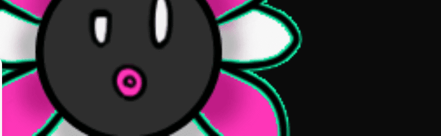

# Not Murakami Flowers

Murakami.Flowers 官方 NFT 在过去 7 天内售出 113 次。Murakami.Flowers Official 的总销售额为 $414.15k。一个 Murakami.Flowers 官方 NFT 的平均价格为 3.7 万美元。Murakami.Flowers 官方拥有者 5,735 人，总供应量 9,632 个。

Murakami.Flowers 是艺术家村上隆的代表作品——花卉，以点状艺术的形式表现出来，让人想起 1970 年代创作的日本电视游戏。该作品正在以数字108为关键词进行开发；108个背景和花色组合构成一个字段，有108个字段。每个字段有 108 个花卉图像，总共有 11,664 个花卉图像。数字 108 指的是 bonnō 或世俗的诱惑。

Murakami.Flowers NFT 受此处提供的收藏家条款的约束

如果您购买 Murakami.Flowers NFT，您将不会获得相应艺术品的商业权利。

Murakami.Flowers 官方 NFT - 常见问题（FAQ）
▶ 什么是村上花官？
Murakami.Flowers Official 是一个 NFT（Non-fungible token）集合。存储在区块链上的数字艺术品集合。
▶ Murakami.Flowers 官方代币有多少？
总共有 9,632 个 Murakami.Flowers 官方 NFT。目前，5,735 位所有者的钱包中至少有一个 Murakami.Flowers 官方 NTF。
▶ 最贵的 Murakami.Flowers 官方特卖是什么？
最昂贵的 Murakami.Flowers Official NFT 是 Murakami.Flower #4389。它于 2022 年 7 月 3 日（大约 2 个月前）以 1.65 万美元的价格售出。
▶ Murakami.Flowers Official 最近卖出了多少？
过去 30 天共售出 1,078 个 Murakami.Flowers 官方 NFT。
▶ Murakami.Flowers Official 多少钱？
在过去的 30 天里，最便宜的 Murakami.Flowers 官方 NFT 销售额低于 2663 美元，最高销售额超过 8.6 万美元。Murakami.Flowers 官方 NFT 的中位价格在过去 30 天内为 4889 美元。
▶ 什么是流行的 Murakami.Flowers 官方替代品？
许多拥有 Murakami.Flowers Official NFT 的用户还拥有 Murakami.Flowers Seed、 Murakami Lucky Cat Coin Bank、 CLONE X-X TAKASHI MURAKAMI和 RTFKT x Nike Dunk Genesis CRYPTOKICKS。

