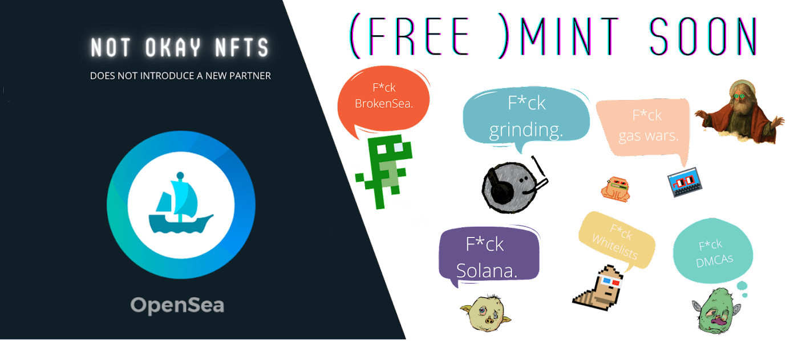

# Not Okay NFTs

NFT 已被污染……白名单、研磨、2.5ETH 薄荷糖、rugpulls、Solana……没有一天没有这些瘟疫袭击我们。每一天，NFT 都变得不那么有趣了。

我们认为 NFT 值得为之奋斗。而今天，我们战斗。在最大的 cc0 集合的帮助下，我们说 F*ck。

Not Okay NFTs NFT - 常见问题（FAQ）
▶ 什么是 Not Okay NFT？
Not Okay NFTs 是一个 NFT（不可替代代币）集合。存储在区块链上的数字艺术品集合。
▶ 存在多少 Not Okay NFT 代币？
总共有 639 个 Not Okay NFTs NFTs。目前，605 位所有者的钱包中至少有一个 Not Okay NFTs NTF。
▶ 最近卖出了多少 Not Okay NFT？
过去 30 天内售出 1 个 Not Okay NFT NFT。
▶ 流行的 Not Okay NFT 替代品有哪些？
许多拥有 Not Okay NFTs NFTs 的用户还拥有 EL NUMEROS、 DegenOkayBears、 WaterBe4nZuki和 Old Legacy。

