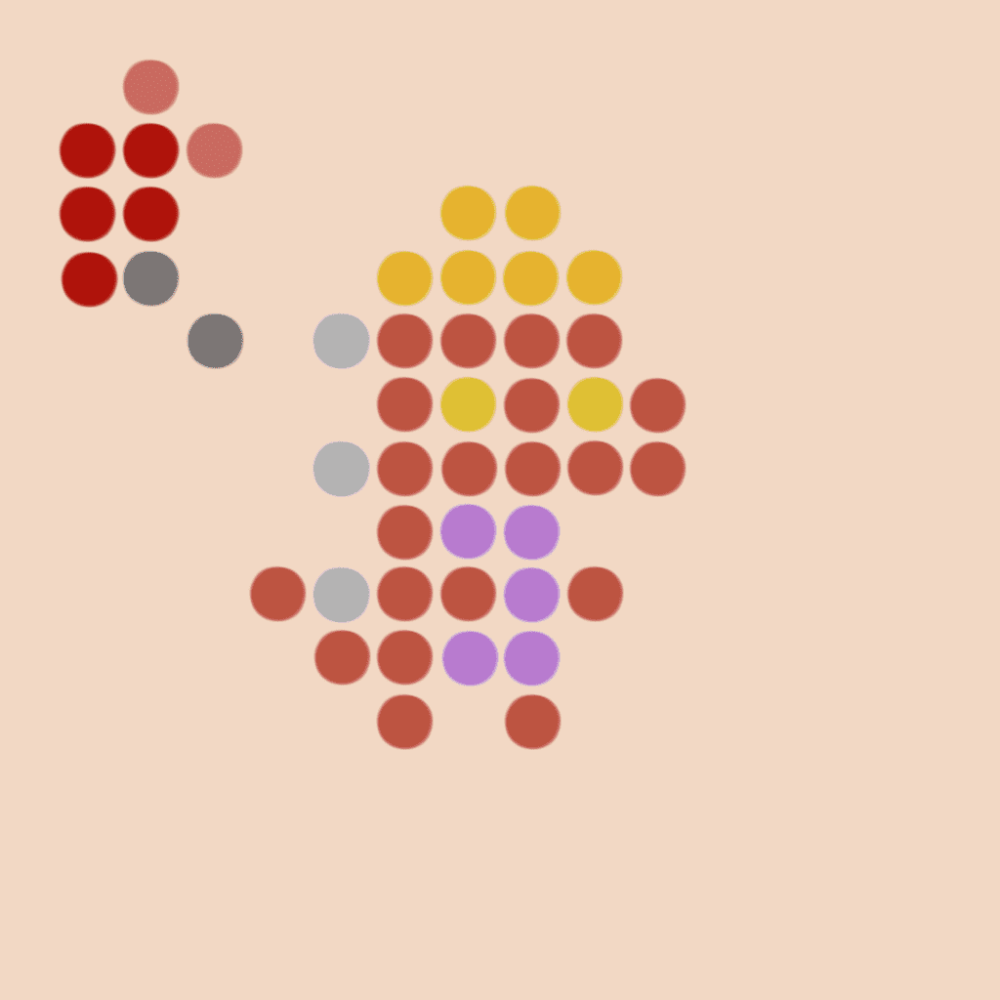

# Not Tiny Echoes

不是微小的回声统计
创建于 4 个月前
1,974 代币供应
10% 费用
过去 7 天没有售出 Not Tiny Echoes。

// 显示刷新元数据

//传播CC0的欢乐
每 TX 2 个 - 免费

只有微小的回声

Not Tiny Echoes NFT - 常见问题（FAQ）
▶ 什么是 Not Tiny Echoes？
Not Tiny Echoes 是一个 NFT（不可替代代币）集合。存储在区块链上的数字艺术品集合。
▶ 存在多少个 Not Tiny Echoes 代币？
总共有 1,974 个 Not Tiny Echoes NFT。目前，426 位车主的钱包中至少有一个 Not Tiny Echoes NTF。
▶ 最近卖出了多少个 Not Tiny Echo？
过去 30 天内售出 0 个 Not Tiny Echoes NFT。
▶ 什么是流行的 Not Tiny Echoes 替代品？
许多拥有 Not Tiny Echoes NFT 的用户还拥有 EL NUMEROS、 DegenOkayBears、 WaterBe4nZuki和 Old Legacy。

