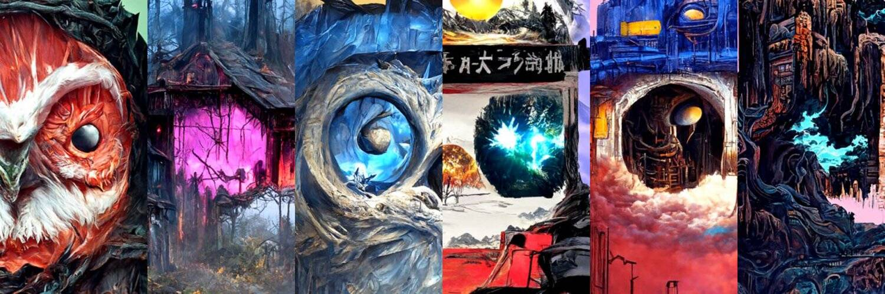

# NotAIMoonbirds

NotAIMoonbirds NFT 在过去 7 天内售出 5 次。NotAIMoonbirds 的总销售额为 19.72 美元。NotAIMoonbirds NFT 的平均价格为 3.9 美元。NotAIMoonbirds 拥有者 593 名，总共拥有 3,752 个代币。

不是 10,000 只 AiMoonBirds 不是我们用艺术和精确度创造出来的

NotAIMoonbirds NFT - 常见问题（FAQ）
▶ 什么是 NotAIMoonbirds？
NotAIMoonbirds 是一个 NFT（非同质代币）集合。存储在区块链上的数字艺术品集合。
▶ 存在多少个 NotAIMoonbirds 代币？
总共有 3,752 个 NotAIMoonbirds NFT。目前，593 位所有者的钱包中至少有一个 NotAIMoonbirds NTF。
▶ 最昂贵的 NotAIMoonbirds 销售是什么？
售出的最昂贵的 NotAIMoonbirds NFT 是 Not AIMoonbird。它于 2022 年 6 月 22 日（2 个月前）以 4.4 美元的价格售出。
▶ 最近卖出了多少只 NotAIMoonbirds？
过去 30 天内售出了 38 个 NotAIMoonbirds NFT。
▶ NotAIMoonbirds 需要多少钱？
在过去 30 天内，最便宜的 NotAIMoonbirds NFT 销售额低于 2 美元，最高销售额超过 4 美元。NotAIMoonbirds NFT 在过去 30 天内的中位价格为 3 美元。
▶ 什么是流行的 NotAIMoonbirds 替代品？
许多拥有 NotAIMoonbirds NFT 的用户还拥有 3DBears、 Loser Ape Club Official、 dadmfers和 CLAYPETS。

