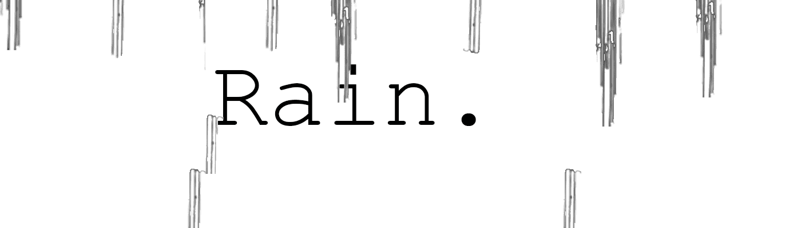

# notBanksyRain

过去 7 天没有售出 notBanksyRain。

与战士战斗，而不是他们的战争。

分享你的自由信息。

// 1974 Nfts // 免费铸币厂

我们不是班克斯雨。

notBanksyRain NFT - 常见问题（FAQ）
▶ 什么是 notBanksyRain？
notBanksyRain 是一个 NFT（不可替代代币）集合。存储在区块链上的数字艺术品集合。
▶ 存在多少个 notBanksyRain 代币？
总共有 1,974 个 notBanksyRain NFT。目前，1,138 位车主的钱包中至少有一个 notBanksyRain NTF。
▶ 最昂贵的 notBanksyRain 促销是什么？
售出的最昂贵的 notBanksyRain NFT 是 Not Banksy #1688。它于 2022-06-19（2 个月前）以 82.3 美元的价格售出。
▶ 最近卖了多少个notBanksyRain？
过去 30 天内售出了 20 个 notBanksyRain NFT。
▶ notBanksyRain 需要多少钱？
过去 30 天，最便宜的 notBanksyRain NFT 销售额低于 4 美元，最高销售额超过 9 美元。在过去 30 天内，notBanksyRain NFT 的中位价格为 6 美元。
▶ 流行的 notBanksyRain 替代品有哪些？
许多拥有 notBanksyRain NFT 的用户也拥有 notBanksySwings、 notBanksyPeace、 NotBanksyChanges和 notBanksyEchoes。

