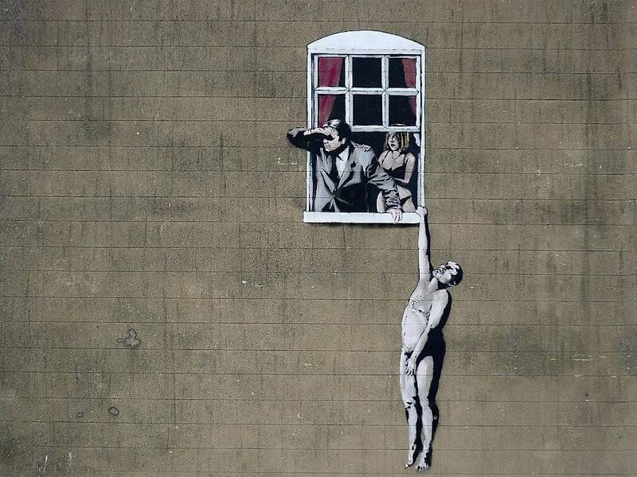

# notBanksyWindow

过去 7 天内没有售出 notBanksyWindow。

阶段 #3 售罄！这是第 4 阶段 notBanksyWindow MINT： notBanksyWindow Mint 网站（0.005ETH）

notBanksyStencils 操作系统// notBanksyAzuki 操作系统// notmfers 操作系统// notGaryvee 操作系统

我们在生活中所做的事情与永恒相呼应。// 不是班克斯

第三阶段：张开双臂。阶段#4：打开你的窗户

谁是第一个幸运儿？

notBanksyWindow NFT - 常见问题（FAQ）
▶ 什么是 notBanksyWindow？
notBanksyWindow 是一个 NFT（不可替代代币）集合。存储在区块链上的数字艺术品集合。
▶ 存在多少个 notBanksyWindow 代币？
总共有 215 个 notBanksyWindow NFT。目前，165 位所有者的钱包中至少有一个 notBanksyWindow NTF。
▶ 最近卖了多少个notBanksyWindow？
过去 30 天内售出 0 个 notBanksyWindow NFT。
▶ 流行的 notBanksyWindow 替代品有哪些？
许多拥有 notBanksyWindow NFT 的用户还拥有 notBanksyballoon、 notBanksyStencils、 notBanksyRobot和 Bored NBA Apes Club。

