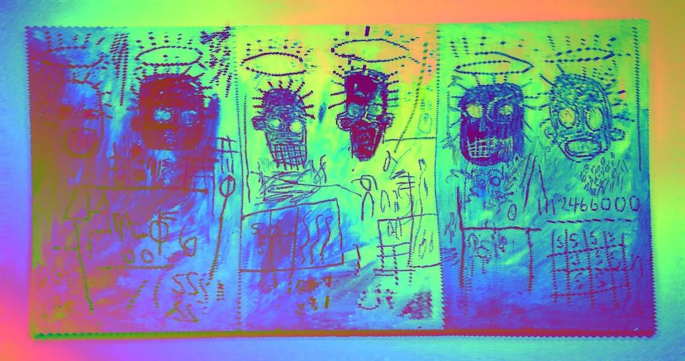

# notBasquiart

过去 7 天没有出售 notBasquiart。

“我不听艺术评论家说什么。我不知道有谁需要批评家来找出艺术是什么。

1111 系列灵感来自让-米歇尔·巴斯奎特。

notBasquiart NFT - 常见问题（FAQ）
▶ 什么是非巴斯奎特？
notBasquiart 是一个 NFT（非同质代币）集合。存储在区块链上的数字艺术品集合。
▶ 存在多少个 notBasquiart 代币？
总共有 632 个 notBasquiart NFT。目前，506 位所有者的钱包中至少有一个 notBasquiart NTF。
▶ 最近卖了多少个notBasquiart？
过去 30 天内售出 0 个 notBasquiart NFT。
▶ 流行的 notBasquiart 替代品有哪些？
许多拥有 notBasquiart NFT 的用户还拥有 Stoned Ducks OG、 OkayApeTown.wtf、 Okay Bull Bears和 Sriracha Inu。

