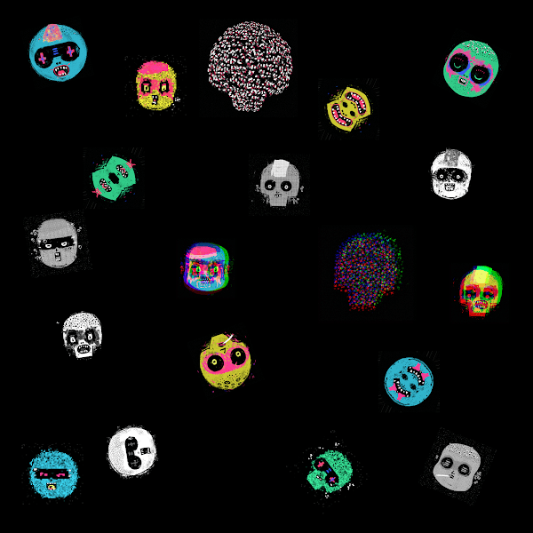

# notGrifters

类型
凿击：38%    阴暗：26.2%     坏人：12%   火焰：23.3%

资产类型
版次：99.5%    传奇版：0.5%

notGrifters NFT - 常见问题（FAQ）
▶ 什么是 notGrifters？
notGrifters 是一个 NFT（不可替代代币）集合。存储在区块链上的数字艺术品集合。
▶ 存在多少个 notGrifters 代币？
总共有 665 个 notGrifters NFT。目前，204 位所有者的钱包中至少有一个 notGrifters NTF。
▶ 最昂贵的 notGrifters 销售是什么？
最昂贵的 notGrifters NFT 不是 Grifter #553。它于 2022-06-12（2 个月前）以 8 美元的价格出售。
▶ 最近卖了多少个notGrifter？
过去 30 天内售出了 1 个 notGrifters NFT。

