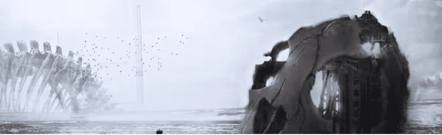

# NOTHINGNESSNOTHING

过去 7 天内没有任何东西出售。

歼灭。八月。空白的。密码。虚无。

NOTHINGNESSNOTHING NFT - 常见问题（FAQ）
▶什么是NOTHINGNESSNOTHING？
NOTHINGNESSNOTHING 是一个 NFT（不可替代令牌）集合。存储在区块链上的数字艺术品集合。
▶ 有多少 NOTHINGNESSNOTHING 代币存在？
总共有 1,001 个 NOTHINGNESSNOTHING NFT。目前，794 位所有者的钱包中至少有一个 NOTHINGNESSNOTHING NTF。
▶ 什么是最昂贵的 NOTHINGNESSNOTHING 销售？
售出的最昂贵的 NOTHINGNESSNOTHING NFT 是 . 它于 2022 年 6 月 22 日（2 个月前）以 22 美元的价格出售。
▶ 最近卖出了多少NOTHINGNESSNOTHING？
过去 30 天内售出了 38 个 NOTHINGNESSNOTHING NFT。
▶ NOTHINGNESSNOTHING 的价格是多少？
在过去 30 天里，最便宜的 NOTHINGNESSNOTHING NFT 销售额低于 4 美元，最高销售额超过 22 美元。在过去 30 天内，NOTHINGNESSNOTHING NFT 的中位价格为 20 美元。
▶ 什么是流行的 NOTHINGNESSNOTHING 替代品？
许多拥有NOTHINGNESSNOTHING NFT的用户还拥有 NEON 363 CLUB、 Gypsy Giraffes、 NGMIFELLAS和 HEX TOYS。

