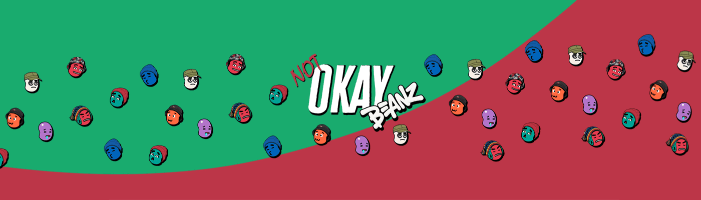

# NotOkayBeanz

NotOkayBeanz 统计  迪兹豆，它们不太好……

过去 7 天没有售出 NotOkayBeanz。

得到你的豆子
NotOkayBeanz 是作为 NFT 铸造的不太好的 bean 的集合。 它们由各种豆子服装、豆子脸、豆子配件、豆子碎片、豆子臂和豆子颜色构成。 得到你自己的豆子！

NotOkayBeanz NFT - 常见问题（FAQ）
▶ 什么是 NotOkayBeanz？
NotOkayBeanz 是一个 NFT（不可替代令牌）集合。存储在区块链上的数字艺术品集合。
▶ 存在多少个 NotOkayBeanz 代币？
总共有 2,020 个 NotOkayBeanz NFT。目前，102 位所有者的钱包中至少有一个 NotOkayBeanz NTF。
▶ 最近卖了多少个 NotOkayBeanz？
过去 30 天内售出 0 个 NotOkayBeanz NFT。

什么是 NotOkayBeanz？
NotOkayBeanz 是在以太坊区块链上作为 NFT 铸造的算法生成的 bean 的集合。NotOkayBeanz 有不同的特征，有些比其他的更稀有，而且……有传言说你可以用它们做豆汤。这是真的吗？
我能得到什么？
你得到一个不好的豆子。
为什么不是OkayBeanz？
因为他们温暖而热情，让你在一切都不好的时候感受到一些东西。

