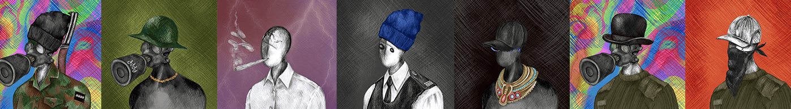

# NotSOLgods

过去 7 天没有售出 NotSOLgods。

不是 Sol Gods，因为真正的神生活在 Eth 上。

众神在迁移到 ETH 时改变了他们的形式，因此他们的孩子可以免受恶魔的影响，也就是 OS Delisting

1000/6666 免费 - 售罄

5666 @ .0069 ETH - 可用

6666 NotSolGods 在以太坊网络上

0% 版税，20% 的薄荷将捐赠给慈善机构。

NotSOLgods NFT - 常见问题（FAQ）
▶ 什么是 NotSOLgods？
NotSOLgods 是一个 NFT（不可替代令牌）集合。存储在区块链上的数字艺术品集合。
▶ NotSOLgods 代币有多少？
总共有 1,166 个 NotSOLgods NFT。目前，127 位所有者的钱包中至少有一个 NotSOLgods NTF。
▶ 最近卖出了多少个 NotSOLgods？
过去 30 天内售出 0 个 NotSOLgods NFT。

