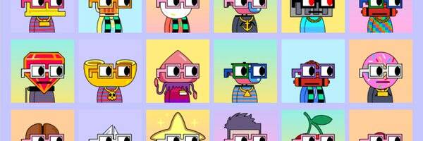

# Noundlez

在过去的 7 天内没有出售任何面条。

通过协作、创新和透明度的力量来娱乐和激励世界各地的人们

🌈 https://twitter.com/noundles 💎 https://discord.gg/noundles ⌐◨-◨

注意：这是已包装的 Noundles 的新集合

Noundles NFT - 常见问题（FAQ）
▶ 什么是面条？
Noundles 是一个 NFT（不可替代代币）集合。存储在区块链上的数字艺术品集合。
▶ 有多少个 Noundles 代币？
总共有 2,275 个 Noundles NFT。目前，18 位所有者的钱包中至少有一个 Noundles NTF。
▶ 最近卖了多少个面条？
过去 30 天内售出 0 个 Noundles NFT。
▶ 什么是流行的 Noundles 替代品？
许多拥有 Noundles NFT 的用户还拥有 Noundles Game、 Unwrapped Noundles、 Phouns NFT和 Nouns3D Verbs。

