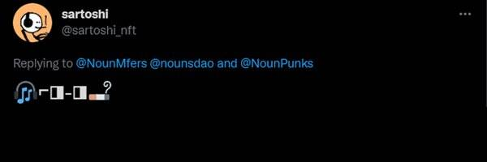

# NounMfers

过去 7 天内没有出售任何名词 Mfer。

Noun Mfers 是精选的 1000 个 NMFERS 精品系列，灵感来自熊市快餐模因。NMFERS 是对 Sartoshi 的 Mfers 系列的模仿。这是一个包罗万象的收藏，所有快餐Mfers在一级市场的定价为0.01-0.02 Ξ，让每个人都能负担得起收藏！随意以任何你想要的方式使用。

名词 Mfers NFT - 常见问题（FAQ）
▶ 什么是名词 Mfers？
Noun Mfers 是一个 NFT（不可替代代币）集合。存储在区块链上的数字艺术品集合。
▶ 存在多少个 Noun Mfers 代币？
总共有 994 个名词 Mfers NFT。目前，49 位所有者的钱包中至少有一个 Noun Mfers NTF。
▶ 最近卖出了多少个名词 Mfer？
过去 30 天内售出 0 个 Noun Mfers NFT。

