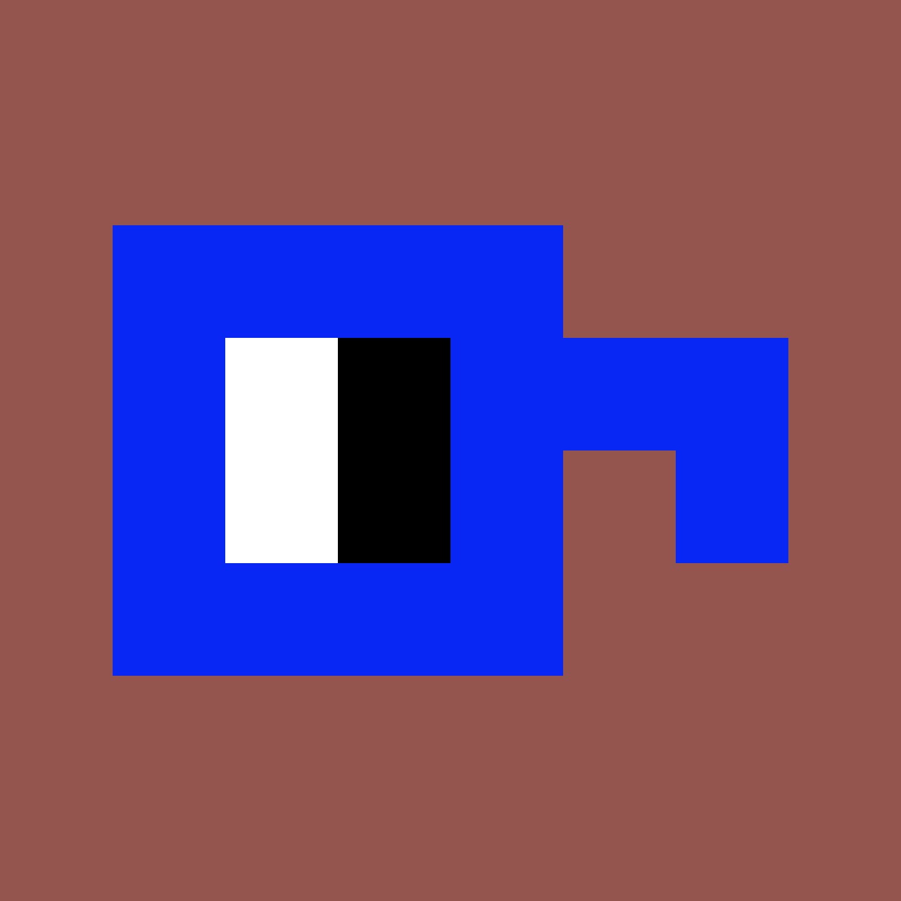

# nounocle

过去 7 天没有出售任何商品。

nounocle 是一个低供应实用程序 CC0 伴侣，可终身免费访问各种未来的名词艺术项目。灵感来自⌐◨-◨

由⌐☻-☻(https://showtime.io/roundshades)和NEURAL [RAIN](https://showtime.io/neuralrain)创建。

该项目属于公共领域。随意以任何你想要的方式使用名词。

nounocle NFT - 常见问题（FAQ）
▶ 什么是名词？
nounocle 是一个 NFT（不可替代令牌）集合。存储在区块链上的数字艺术品集合。
▶ 存在多少个 nounocle 代币？
总共有 300 个 nounocle NFT。目前 117 位所有者的钱包中至少有一个 nounocle NTF。
▶ 最昂贵的 nounocle 销售是什么？
出售的最昂贵的 nounocle NFT 是 nounocle #101。它于 2022 年 6 月 24 日（2 个月前）以 11 美元的价格出售。
▶ 最近卖了多少nunocle？
过去 30 天内售出了 1 个 nounocle NFT。

