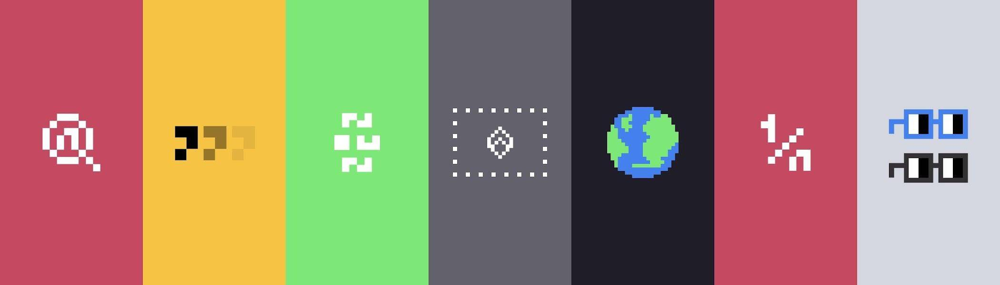

# NounQuest

过去 7 天内没有出售任何 NounQuest。

为 Nouns 生态系统进行的以游戏赚钱的寻宝游戏。
钥匙将解锁每场比赛的第一条线索。

NounQuest NFT - 常见问题（FAQ）
▶ 什么是名词任务？
NounQuest 是一个 NFT（不可替代令牌）集合。存储在区块链上的数字艺术品集合。
▶ 有多少个 NounQuest 代币？
总共有 1 个 NounQuest NFT。目前，23 位所有者的钱包中至少有一个 NounQuest NTF。
▶ 最昂贵的 NounQuest 销售是什么？
出售的最昂贵的 NounQuest NFT 是 Genesis Key。它于 2022 年 6 月 5 日（3 个月前）以 145.6 美元的价格售出。
▶ 最近卖出了多少个 NounQuest？
过去 30 天内售出了 2 个 NounQuest NFT。
▶ 什么是流行的 NounQuest 替代品？
许多拥有 NounQuest NFT 的用户还拥有 CryptoMarineLife、 EL NUMEROS、 DegenOkayBears和 WaterBe4nZuki。

