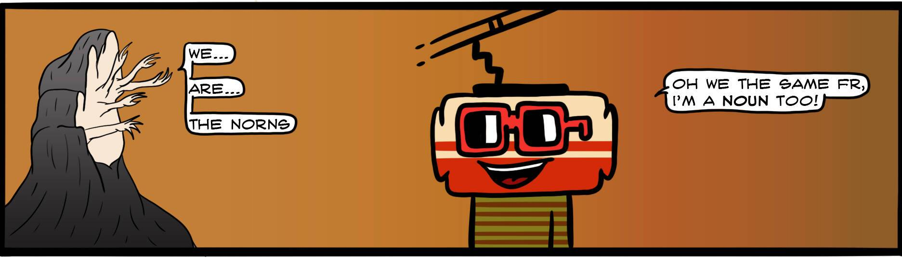

# Nouns Comic

过去 7 天内没有出售任何名词漫画。

漫画是NounsDAO“Memetic Consistency”基础的完美体现。Nouns Comic 是第11 个链上提案，在3 个月的时间里被订购了 9 期。由Undead Oracle为名词创建

名词 漫画 NFT - 常见问题（FAQ）
▶ 什么是名词漫画？
Nouns Comic 是一个 NFT（Non-fungible token）集合。存储在区块链上的数字艺术品集合。
▶ 有多少个 Nouns Comic 代币？
总共有 3 个 Nouns Comic NFT。目前 21 位所有者的钱包中至少有一个 Nouns Comic NTF。
▶ 最近卖了多少Nouns Comic？
过去 30 天内共售出 0 个 Nouns Comic NFT。

