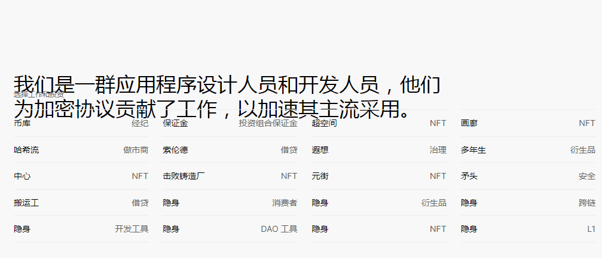

# Nouns x Vector

过去 7 天没有出售任何名词 x 向量。

Nouns x Vector 是 NFT NYC 期间在 NYC 周围展示的重新混合 Nouns 文物的艺术品集合。

名词 x 向量 NFT - 常见问题（FAQ）
▶ 什么是名词 x 向量？
Nouns x Vector 是一个 NFT（Non-fungible token）集合。存储在区块链上的数字艺术品集合。
▶ 存在多少个名词 x 向量标记？
总共有 375 个名词 x 向量 NFT。目前 171 位所有者的钱包中至少有一个 Nouns x Vector NTF。
▶ 最昂贵的 Nouns x Vector 销售是什么？
出售的最昂贵的名词 x 向量 NFT 是 Adam Ho #20 — 名词 x 向量。它于 2022 年 6 月 23 日（2 个月前）以 153.7 美元的价格售出。
▶ 最近卖出了多少个Nouns x Vector？
过去 30 天内售出了 9 个 Nouns x Vector NFT。

