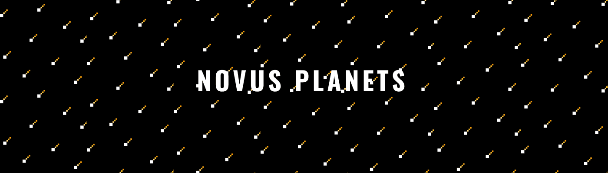

# NovusPlanets

过去 7 天没有售出 NovusPlanets。

10,000 颗独特行星的集合，可让您进入太阳系。持有者将有机会获得独家的未来掉落、收藏等。所有收益的 15% 用于慈善事业，以帮助地球、环境和濒临灭绝的动物。有数以千计的 Novus 行星，但我们的星球只有一个。

你会伸手摘星吗？

NovusPlanets NFT - 常见问题（FAQ）
▶ 什么是 NovusPlanets？
NovusPlanets 是一个 NFT（不可替代代币）集合。存储在区块链上的数字艺术品集合。
▶ 有多少 NovusPlanets 代币？
总共有 100 个 NovusPlanets NFT。目前 3 位所有者的钱包中至少有一个 NovusPlanets NTF。
▶ 最近卖出了多少 NovusPlanets？
过去 30 天内共售出 0 个 NovusPlanets NFT。

