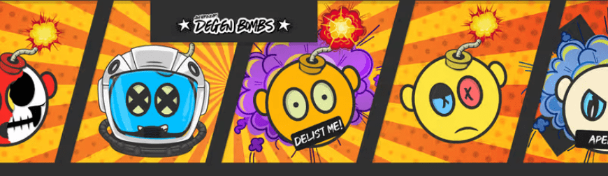

# Nowhere Near Degen Bombs

Degen Bombs Gen 1 NFT 在过去 7 天内售出 8 次。Degen Bombs Gen 1 的总销售额为 28.54 美元。一枚 Degen Bombs Gen 1 NFT 的平均价格为 3.6 美元。有 488 名 Degen Bombs Gen 1 所有者，总供应量为 6,000 个代币。

离很远！Degen Bombs 是部署在以太坊区块链上的数字收藏品，包含 6,000 个可用的 400 多个特征，可作为您的 pfp 随处共享！让我们得到德根！

Degen Bombs Gen 1 NFT - 常见问题（FAQ）
▶ 什么是 Degen Bombs Gen 1？
Degen Bombs Gen 1 是一个 NFT（非同质代币）集合。存储在区块链上的数字艺术品集合。
▶ 存在多少 Degen Bombs Gen 1 代币？
总共有 6,000 个 Degen Bombs Gen 1 NFT。目前，488 位车主的钱包中至少有一个 Degen Bombs Gen 1 NTF。
▶ 最昂贵的 Degen Bombs Gen 1 销售是什么？
售出的最昂贵的 Degen Bombs Gen 1 NFT 是 Nowhere Near Degen Bombs #543。它于 2022-07-01（大约 2 个月前）以 11 美元的价格售出。
▶ 最近售出了多少 Degen Bombs Gen 1？
过去 30 天内售出了 11 个 Degen Bombs Gen 1 NFT。
▶ Degen Bombs Gen 1 的价格是多少？
在过去 30 天里，最便宜的 Degen Bombs Gen 1 NFT 销售额低于 1 美元，最高销售额超过 11 美元。在过去 30 天内，Degen Bombs Gen 1 NFT 的中位价格为 1 美元。
▶ 什么是流行的 Degen Bombs Gen 1 替代品？
许多拥有 Degen Bombs Gen 1 NFT 的用户还拥有 1 of 1 tinymfer's、 Okay CloneX、 Okay Grandpa Bears和 ChimpersX。

