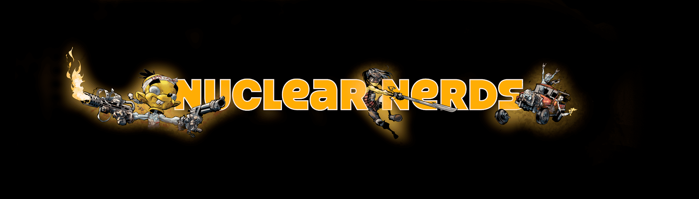

# Nuclear Nerd Comics

核书呆子漫画 NFT 在过去 7 天内售出 15 次。核书呆子漫画的总销售额为 796.13 美元。一本核书呆子漫画 NFT 的平均价格为 53.1 美元。有 3,234 位核子书呆子漫画所有者，总共拥有 8,998 个代币。

有 8,999 个 Nuclear Nerds 漫画代币，每个都可以在该期的升级窗口中升级到最新的漫画期。这样做会将漫画令牌的展示艺术更改为该期的封面艺术。升级后，漫画代币不能退回到前一期。请记住：Comic 代币的初始空投附加到该代币的父书呆子，并在出售时自动取消配对。查看属性以查看令牌的状态。

核书呆子漫画 NFT - 常见问题（FAQ）
▶ 什么是核书呆子漫画？
核书呆子漫画是一个 NFT（不可替代令牌）集合。存储在区块链上的数字艺术品集合。
▶ 有多少核书呆子漫画代币？
总共有 8,998 个核书呆子漫画 NFT。目前，3,234 位所有者的钱包中至少有一本 Nuclear Nerd Comics NTF。
▶ 最昂贵的核书呆子漫画销售是什么？
最昂贵的核书呆子漫画 NFT 是 核书呆子漫画 #8815。它于 2022-06-18（2 个月前）以 76.8 美元的价格售出。
▶ 最近卖了多少核书呆子漫画？
过去 30 天内售出了 69 份核书呆子漫画 NFT。
▶ 一部核子书呆子漫画要多少钱？
过去 30 天，最便宜的核书呆子漫画 NFT 销售额低于 36 美元，最高销售额超过 71 美元。过去 30 天内，Nuclear Nerd Comics NFT 的中位价格为 55 美元。
▶ 什么是流行的核书呆子漫画替代品？
许多拥有Nuclear Nerd Comics NFT 的用户还拥有 Nuclear Nerds of the Accidental Apocalypse、 Mekaformers Legacy、 FlippedMoonbirds和 ASCII MFER。

