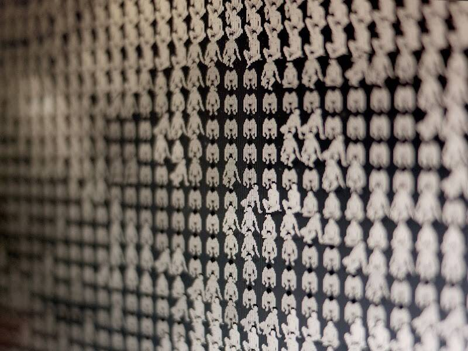

# NudemeNFT

过去 7 天没有售出 NudemeNFT Genesis。

NudemeNFT 是一组独特的互动艺术，在以太坊区块链上具有完全链上元数据。在公开发售于 2021 年 11 月 1 日永久暂停之前，仅铸造了 911 件。每件艺术品 (NFT) 由 1 到 2,500 名编程的裸体人组成，从 120 多个策划的视觉效果中挑选出一种图案、图像或信息。

NudemeNFT Genesis NFT - 常见问题（FAQ）
▶ 什么是 NudemeNFT Genesis？
NudemeNFT Genesis 是一个 NFT（不可替代令牌）集合。存储在区块链上的数字艺术品集合。
▶ 存在多少 NudemeNFT Genesis 代币？
总共有 911 个 NudemeNFT Genesis NFT。目前，317 位所有者的钱包中至少有一个 NudemeNFT Genesis NTF。
▶ 最近卖出了多少 NudemeNFT Genesis？
过去 30 天内售出了 3 个 NudemeNFT Genesis NFT。

