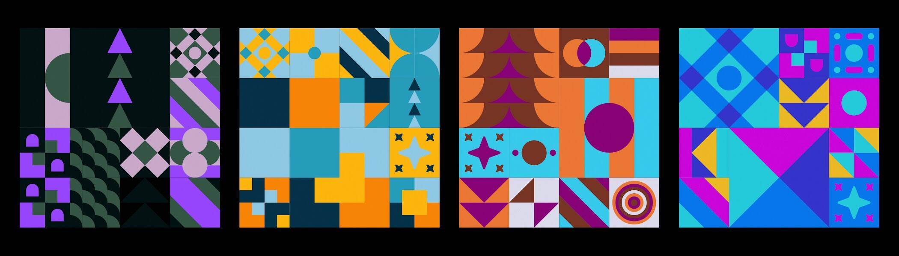

# Nue Geo

过去 7 天没有售出 Nue Geo。

程序生成的几何图案，注入了 OpenPalette 颜色。

基因组块程序生成网格组并用几何形状填充它们。然后通过美学驱动的规则将您的调色板颜色插入到新的阴影中，产生令人惊讶的结果。

可以铸造 1000 个 NFT。每个 OpenPalette 只能铸造一个 NFT。如果您在销售开始后在 OpenSea上购买 OpenPalette，请确保它尚未被使用

Nue Geo NFT - 常见问题（FAQ）
▶ 什么是 Nue Geo？
Nue Geo 是一个 NFT（不可替代令牌）集合。存储在区块链上的数字艺术品集合。
▶ 有多少 Nue Geo 代币？
总共有 1,459 个 Nue Geo NFT。目前，722 位车主的钱包中至少有一个 Nue Geo NTF。
▶ 最近卖出了多少 Nue Geo？
过去 30 天内售出 0 个 Nue Geo NFT。

