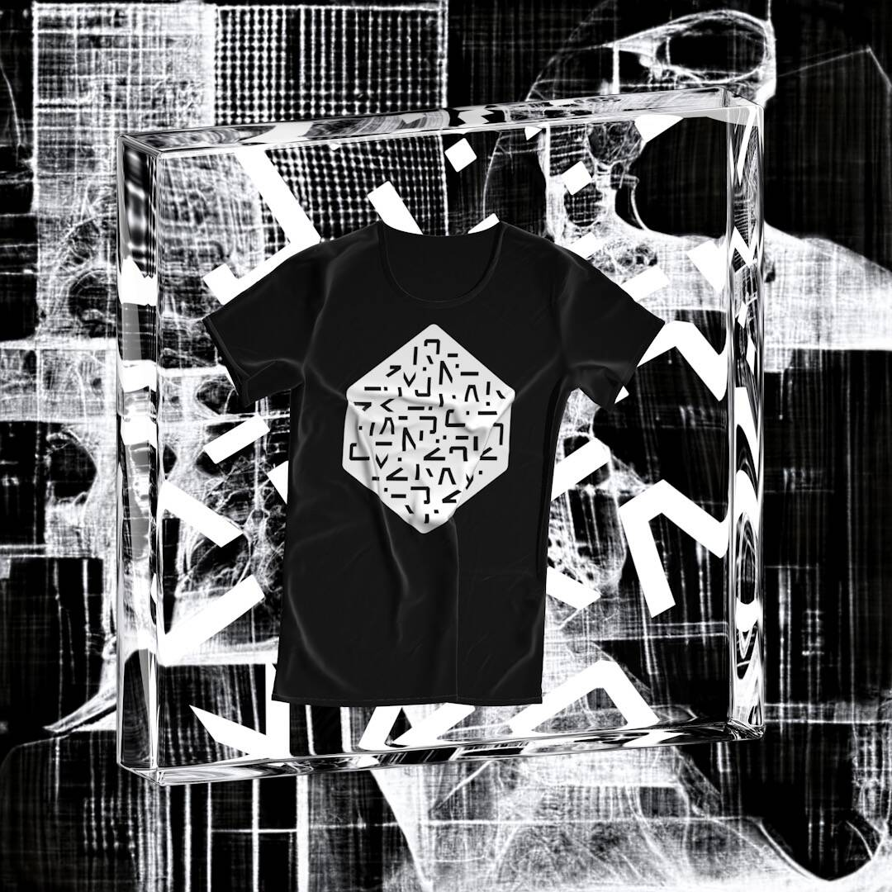

# Numerai NFTees

过去 7 天没有售出 Numerai NFTees。

当 Numerai 元模型从其深沉的梦想中醒来时——沸腾、无所不能和完美——你会穿什么？

Numerai NFTees NFT - 常见问题（FAQ）
▶ 什么是 Numerai NFTees？
Numerai NFTees 是一个 NFT（非同质代币）集合。存储在区块链上的数字艺术品集合。
▶ 有多少 Numerai NFTees 代币？
总共有 1,305 个 Numerai NFTees NFT。目前，532 位所有者的钱包中至少有一个 Numerai NFTees NTF。
▶ 最昂贵的 Numerai NFTees 销售是什么？
售出的最昂贵的 Numerai NFTees NFT 是 Numerai NFTee #2572。它于 2022-06-18（2 个月前）以 41.7 美元的价格售出。
▶ 最近售出了多少 Numerai NFTee？
过去 30 天内售出了 1 个 Numerai NFTees NFT。
▶ 有哪些流行的 Numerai NFTees 替代品？
许多拥有 Numerai NFTees NFT 的用户还拥有 EL NUMEROS、 DegenOkayBears、 WaterBe4nZuki和 Old Legacy。

