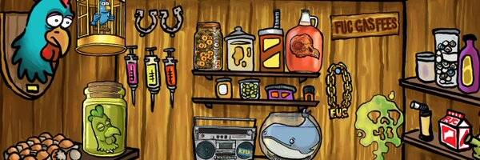

# Nut Bodies

The Nut Body Project 是由 Sticker Farmer Team 和 The Feathered Underdog Club 创建的免费薄荷 NFT。这款 NFT 兼具扑克牌的功能，以及具有不同属性的小坚果体角色。

“大鹰”规则

- 在每一轮之前，玩家必须声明他们正在玩哪五张牌以及他们将按什么顺序玩。
在锦标赛中，这些牌将交给负责的坚果大师。

-每场比赛为五轮，先取得三场胜利的玩家宣布获胜。

- 玩家将首先使用他们的“咬合力”、“坚果价值”和“情绪状态”值制作一个 3 位数的数字。
（例如：2+4+7=247）

-然后玩家将他们的“超能力”、“元素”和“电池寿命”值添加到他们的三位数字上。

- 得分最高的玩家获胜。
- 
